## _Tutoriel : Comment créer un filtre Gachapon_

### Introduction

Dans ce tutoriel, nous allons apprendre à créer un filtre inspiré par les machines Gachapon, machines de jouets typiquement japonaises. Nous allons donc rendre le jouet dans la capsule aléatoire.

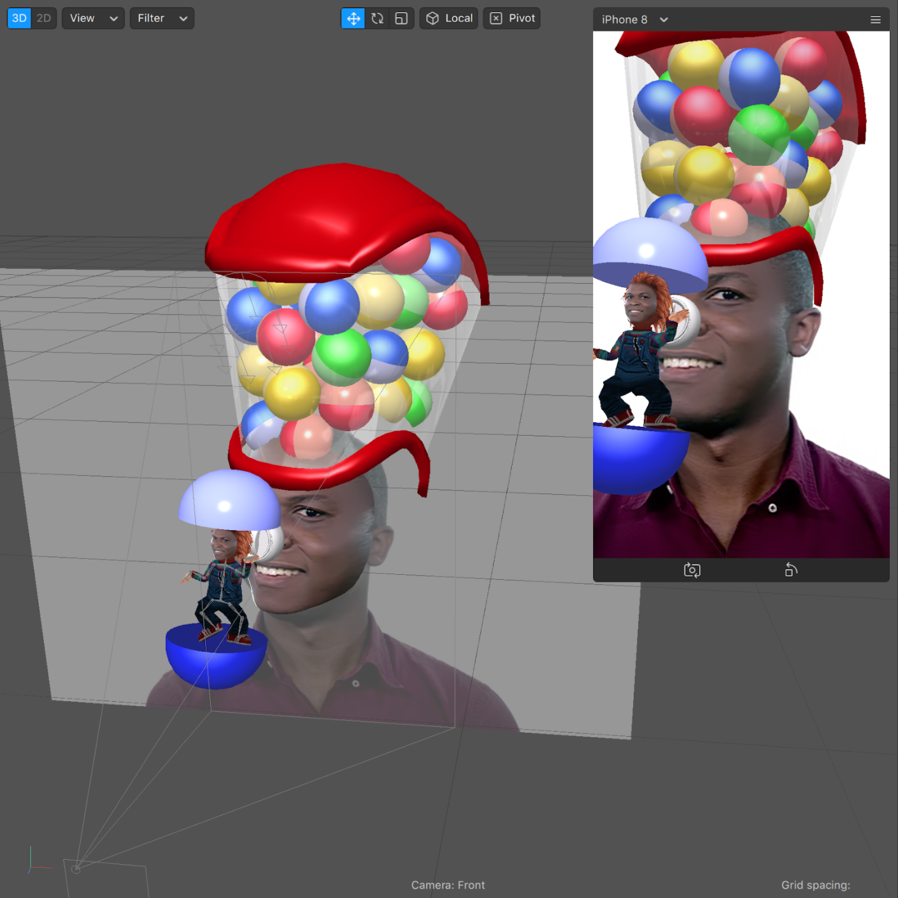

Ce tutoriel couvrira les techniques suivantes :

1. Rendre l'objet résultant aléatoire
2. Animer la position, la taille et la rotation de l'object
3. Travailler avec couches et textures
4. Interactions faciales

Pour réaliser ce projet, vous aurez besoin des assets suivants :

1. Un modèle d'une machine gachapon
2. Une poignée de machine gachapon
3. Divers jouets a faire apparaître dans les capsules
4. Une capsule 3D
5. Une autre capsule 3D, séparée en deux parties
6. L'occluder pour la tête fourni dans les assets faciaux officiels de SparkAR

### 1ère partie - _Le début_

Nous allons commencer par ouvrir un projet vide sur SparkAR. Naviguer vers le panneau des assets, fenêtre située en bas à gauche et clicker le signe "+". De là nous allons importer les objets 3D nécessaires.

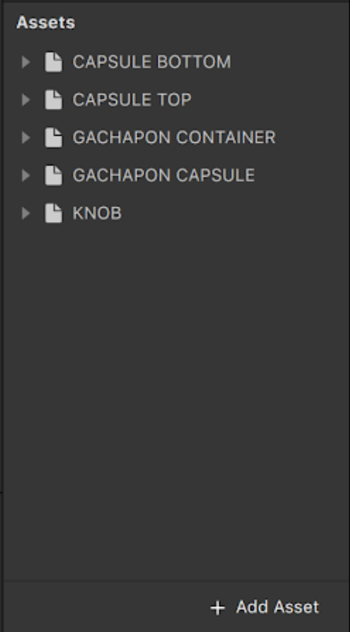

Nous avons donc dans notre projet les objets suivants :
1. Le conteneur gachapon
2. La poignée
3. Deux parties de capsules 3D (Le bas et le haut. Nous aurions pu ici importer une seule moitié de capsule, la dupliquer et tourner la copie à 180°) 
4. Une capsule 3D complète

Pour rester plus court, nous remplacerons les jouets par de simples formes géométriques 3D, que l'on va prendre dans la libraire d'assets de SparkAR.

Retourner dans le panneau d'assets et clicker sur "Add asset", puis "Search AR Library". Une nouvelle fenêtre s'ouvrira, clicker sur "3D objects" et choisissez les primitives simples.
Importer les objets suivants :

1. Cube
2. Sphere
3. Icosahedron
4. Torus
5. Tetrahedron

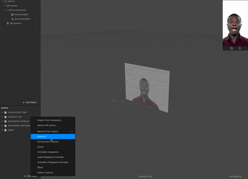

N'oubliez pas d'importer l'occluder facial des assets de SparkAR (également trouvable dans le dossier downloads de ce projet)

Votre panneau d'assets devrait ressembler à ceci :

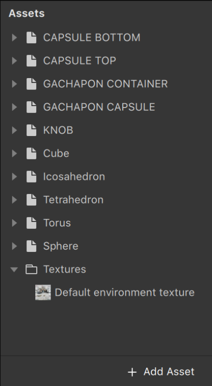

Rendez vous maintenant sur la tabulation de "Layers", en haut à gauche à côté de votre tabulation Scene et ajouter deux nouvelles couches.
Renommer la première couche "Top layer", la deuxième "Middle layer" et la troisième "Bottom layer"

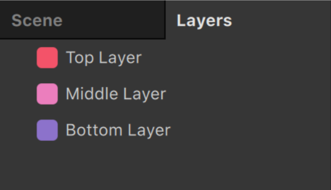

Retourner maintenant dans l'inspecteur de scène et click droit sur "Focal Distance", ajouter un "Face Tracker". Click droit sur le face tracker et rajouter deux Face Meshes. Renommer ensuite le premier "Retouch" et le second "Face". Retouch devrait être sur la "Top layer" et Face sur la "Middle layer". Décocher aussi les checkbox "eyes" et "mouth" sur les deux.

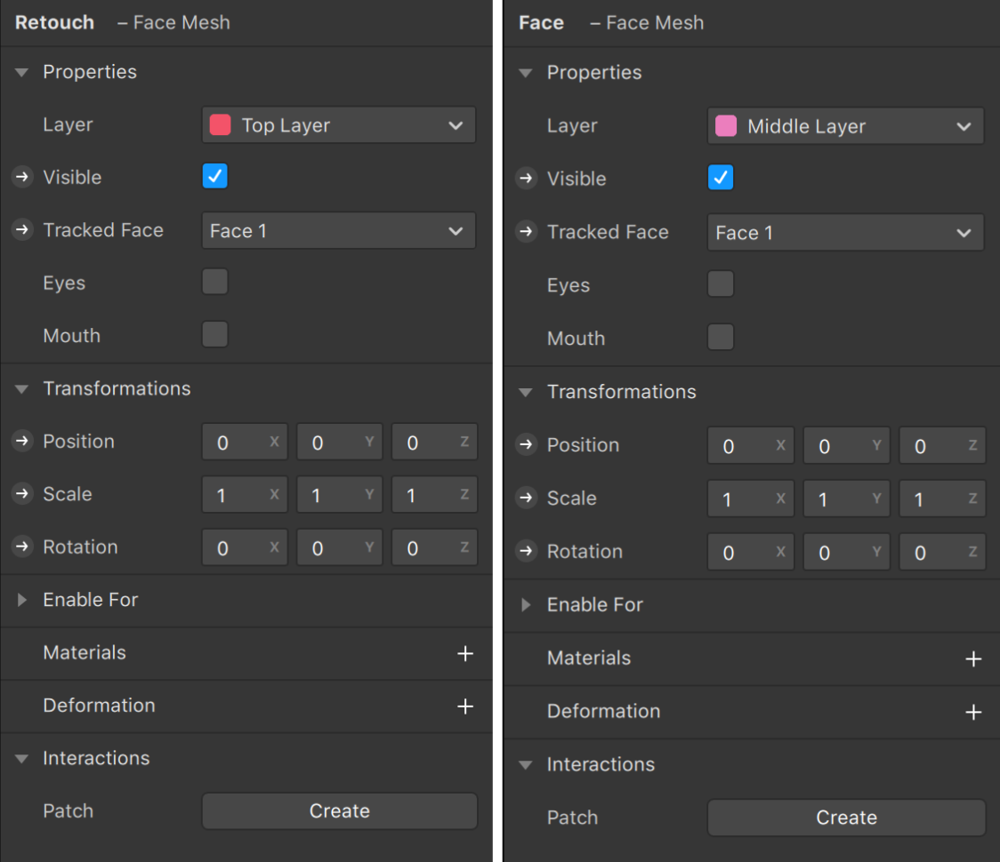

Maintenant créer deux matériaux pour les deux facemesh. Il suffit d'en sélectionner un, naviguer vers "Matérials" à droite et clicker sur le "+". Trouver le matériau nouvellement créer et sélectionner le à gauche afin d'en ouvrir les propriétés.

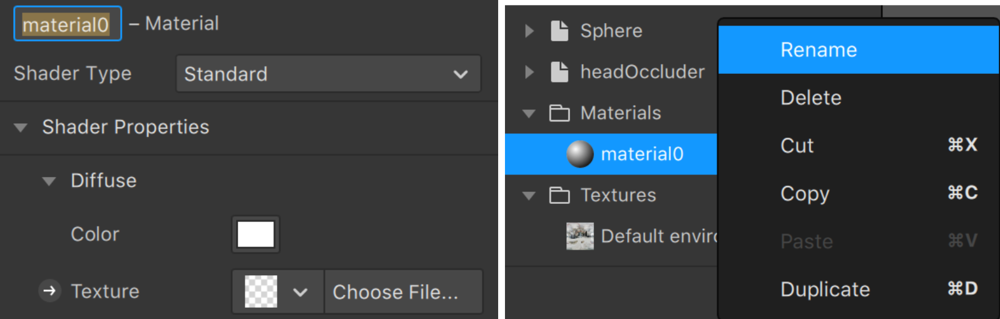

Renommer le "Retouch" et assigner lui le shader type "Retouching".

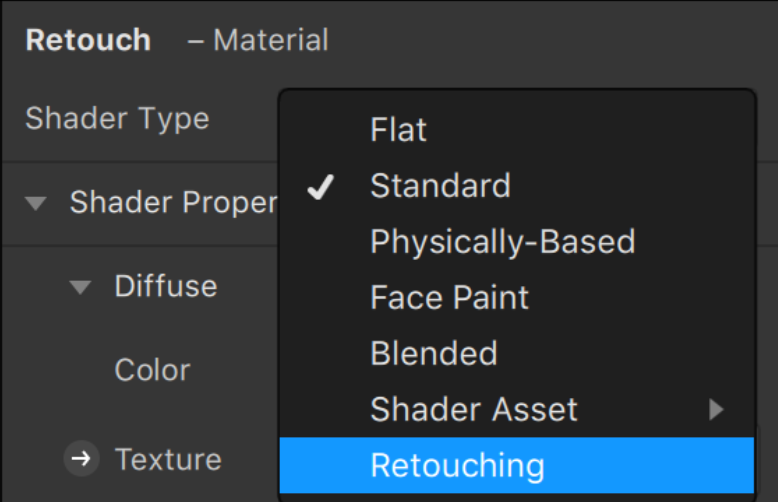

Avant de faire la même chose pour notre autre facemesh, selectionner le face tracker et, dans les options à droite, clicker le "+" à côté de "Texture Extraction". Ceci nous permettra d'avoir la texture du visage tracké en tant que texture, que l'on assignera à notre matériel pour "Face".

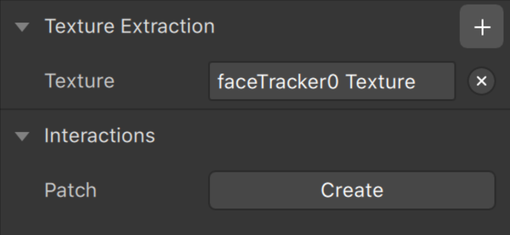

Créer lui donc un matériel et renommer le "Face". Cette fois-ci changer le shader type à "Flat" et, just en-dessous sous Texture, sélectionner la texture extraite.

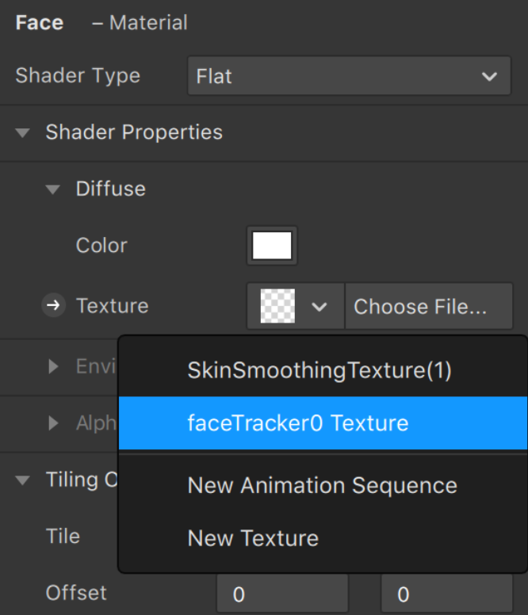

### 2ème partie - _Mise en place de la machine gachapon_

Naviguer dans le panneau d'assets et sélectionnez le "Head Occluder", et mettez en une instance dans le facetracker. Retourner dans le panneau, prenez le container gachapon et mettez le dans le Head Occluder, qu'il en soit "enfant". Voici à quoi cela devrait ressembler :

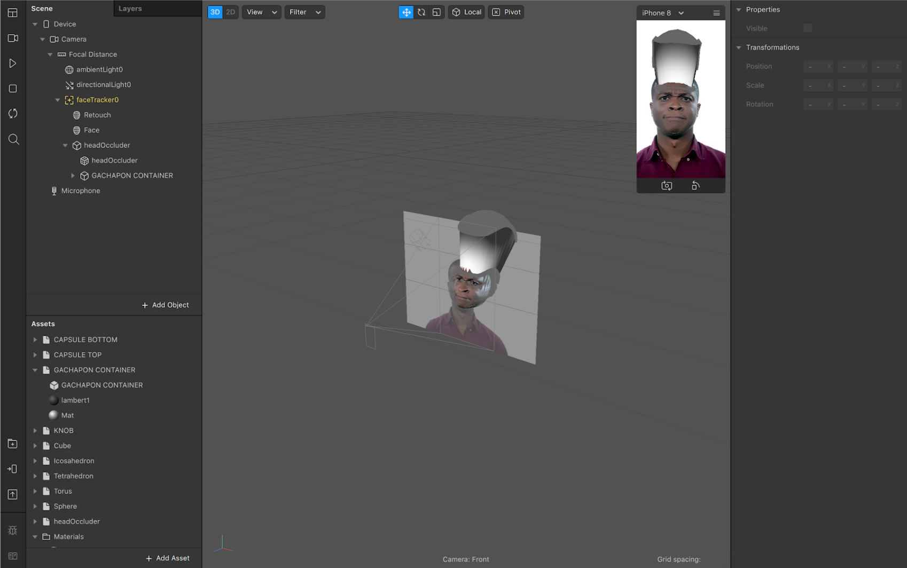

Redimensionner l'occluder de 1 à 1,1 en X, Y et Z

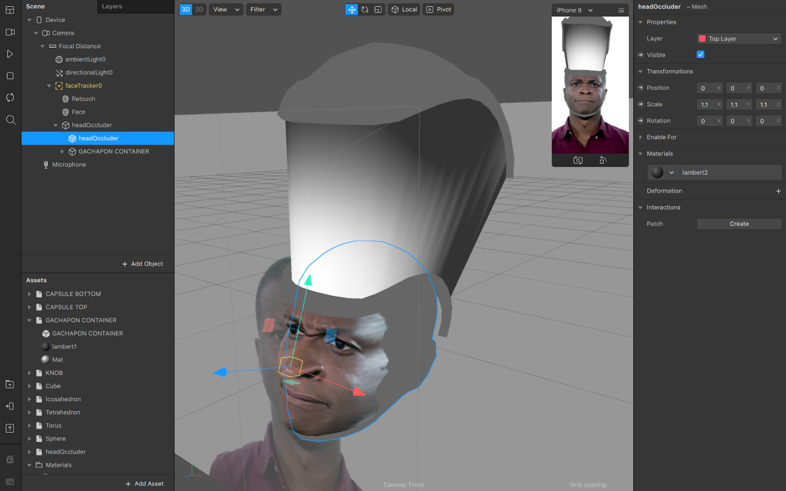

Faites de même pour le container gachapon, de 1 à 1,2 en X, Y et Z. Positionner le aussi correctement, qu'il repose naturellement sur l'occluder facial.

Aller dans le matériel du Head Occluder et changer son blend mode de "Replace" à "Alpha" et réduisez son opacité de 100 à 1. L'occluder devrait maintenant être invisible.
Dans le matériel du container gachapon maintenant, selon comment votre objet 3D a été créer, vous trouverez un ou plusieurs emplacements pour les matériaux. Dans notre exemple, un emplacement correspond au verre, l'autre à la structure. Créer deux matériaux (vous verrez également à ce moment quel matériel s'applique sur quelle partie). Renommez celui de la structure "outline" et choisissez une couleur. Cochez l'option Specular et mettez la valeur "smoothness" aux alentours de 60.

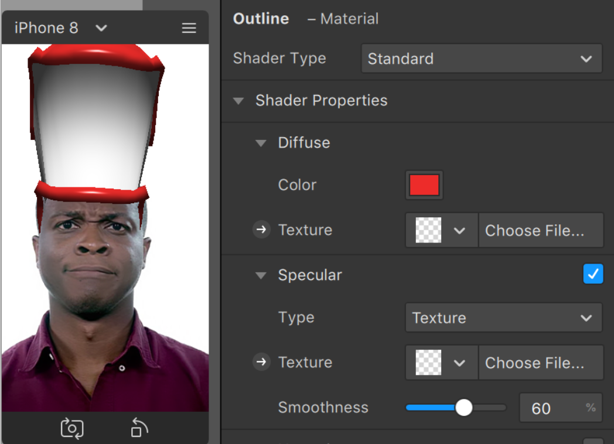

Avant de passer au matériel pour le verre, nous allons importer une texture d'environement. Naviguer au panneau d'assets et clicker sur "Add Asset" > "Environment Texture" et choisissez en une. Ici nous avons opté pour Skylit Garage.

Retournez dans l'inspecteur de scène et ajouter une "Environment Light" (notabene : celle-ci ne doit pas être enfant du facetracker). Sélectionnez là et dans l'inspecteur, sous Texture, choisissez Skylit Garage.

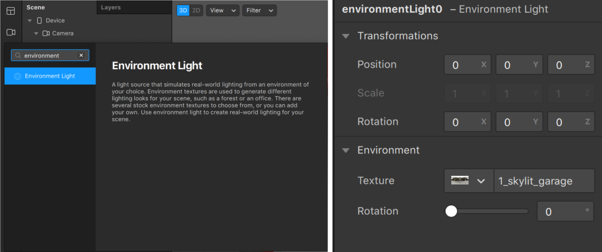

Maintenant, retournez dans le matériel pour le verre et changer le shader type à "Physically Based". Fixer le paramètre "metallic" à 70, cocher l'Emission et changer la couleur pour qu'elle soit plus clair que du noir. Cocher également Environment, assurez vous que le blend mode soit bien "Alpha" que l'opacité est aux alentours des 30% et que "double-sided" est bien coché.

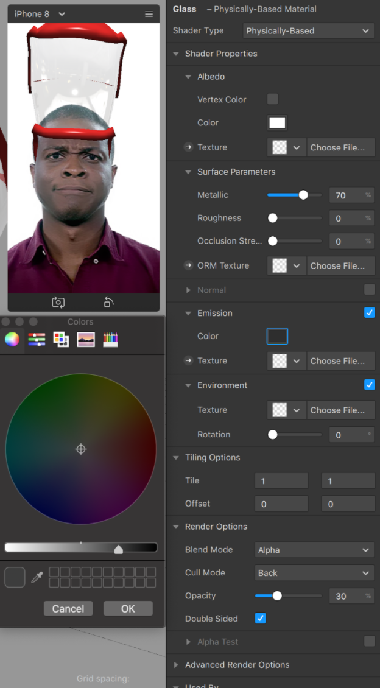

Naviger maintenant dans le paneau des assets et déposer votre capsule gachapon complète comme enfant du Head Occluder.

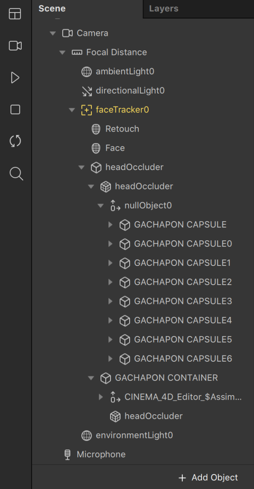

Déplacer le dans le container et dupliquer le plusieurs fois, selon le nombre de capsules avec lesquelles vous voulez remplir la machine. Libre à vous de les agrandir et les pivoter afin de les diversifier visuellement. Vous pouvez également préparer plusieurs sets de matériaux avec couleurs légèrement différents à appliquer à vos capsules.

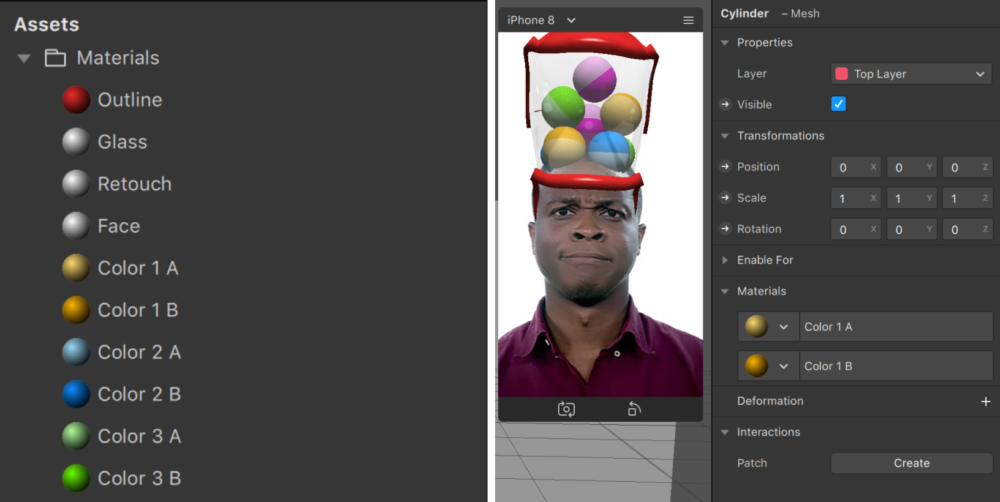

Retournez dans le panneau d'assets et déplacer la poignée comme enfant du Face Tracker.
Redimensionnez et positionnez là afin qu'elle soit plus ou moins au niveau du nez de l'utilisateur. Créer également un matériel pour. Nous allons en faire un matériel aux allures plus plastiques, pour lequel le shader de base "Standard" semble convenir. Nous allons cependant checker "Specular" et changer la softness à 65%. Finalement ajouter une touche de rouge au triangle sur la poignée afin que celle-ci soit plus visible.

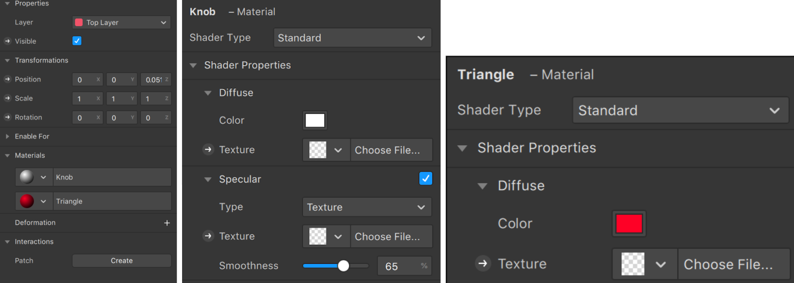

Nous allons maintenant animer la poignée afin qu'elle tourne sur elle-même plusieurs fois lorsque l'utilisateur ouvre sa bouche, et donc avant que la capsule ne sorte.

Pour y parvenir, sélectionner le face tracker et, dans l'inspecteur, sous "Interactions", activer le dropdown. Il y a plusieurs interactions disponibles mais nous allons nous intéresser dans notre cas à "Mouth Open". Le sélectionner devrait faire apparaître l'éditeur de patch. Vous pourrez voir dedans une chaîne qui lie notre nouvelle interaction avec le face tracker au biais de patchs. C'est ici que nous allons maintenant ajouter les patchs dont nous avons besoin pour animer nos objets. Pour ajouter un patch, naviguer en bas de l'éditeur vers l'option "Add patch" ou click droit n'importe où dans l'éditeur. Voici la liste à importer :

1. Pulse
2. Animation (Renommer celui-ci Animation 1 en double cliquant son nom)
3. Transition

Maintenant connecter ces nouveaux patchx à ceux existants de cette manière : (inputs seront à gauche du patch, outputs à droite)
- Mouth Open State output > Pulse On/Off input
- Pulse ON output  > Animation Play input
- Pulse OFF output  > Animation Reset input
- Animation Progress Output > Transition Progress input
- Transition Value Output > Knob 3D Rotation input

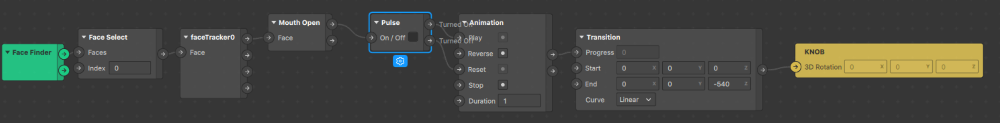

Changer maintenant les valeurs dans le patch Transition. Dans notre cas, la poignée a l'air bien orientée si l'on regarde ses axes de déplacement, inutile donc de s'en soucier. Nous allons partir sur  toutes les valeurs à 0, et ainsi nullifier tout mouvement par défaut. Nous voulons simplement pivoter la poignée sur un axe de rotation précis, ici l'axe Z, que nous fixerons à -540 dans la deuxième étape du patch. Nous pouvons aussi changer le feel de l'animation en la passant de Linear à Sinusoidal in and out par exemple.

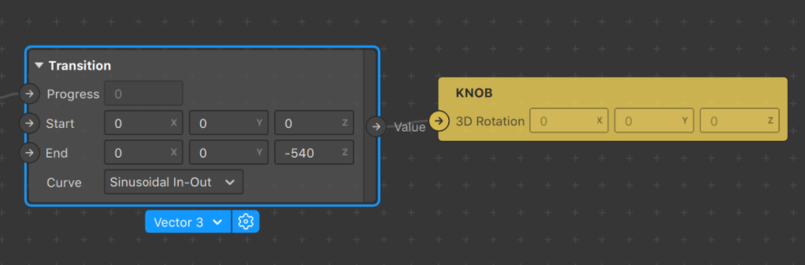

Passong pour la suite aux capsules gachapons et "jouets" qui en sortiront.

### 3ème partie - _Les capsules_

Click droit sur le Face tracker et ajouter un "Null obect". Renommer celui-ci à "Gachapon 1" et dupliquer le en fonction du nombre de jouets que vous voulez comme options aléatoires. Dans ce projet nous allons en proposer 5 donc nous allons le dupliquer quatre fois. Dans chaque objet null, déposer une instance de Capsule Bottom 3D, Capsule Top 3D et un jouet. Votre scène devrait ressembler à ceci :

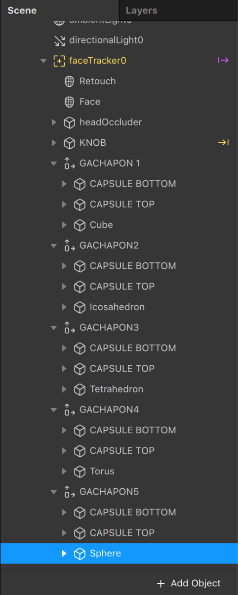

Commencons par rendre les couleurs des capsules qui sortent aléatoires.

Pour ceci, rajouter un patch "Random" et un "Option Picker".
En-dessous de ce dernier patch, vous trouverez l'option pour le changer de "Number" à "Color". Assigner ces couleurs en fonction de celles déjà présentes dans le container.

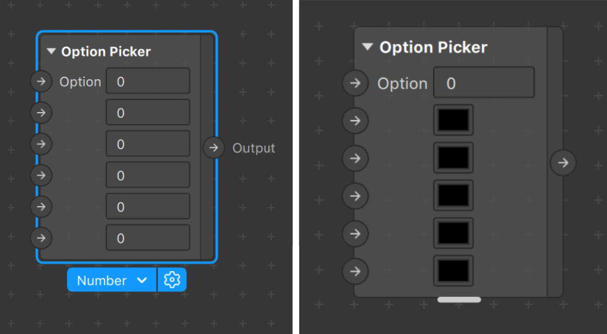

Afin d'avoir les couleurs exactes, vous pouvez copier leur code hexa (format #FFFFFF) en les récupérant sur vos matériaux déjà créés. Puisque nous n'avons actuellement que quatre couleurs, il n'y a pas besoin de changer la dernière, elle peut rester noire.

Connections à faire :
1. Vous vous souvenez du patch Animation connecter à la rotation de la poignée? Connecter l'output "Completed" de ce patch à l'input "Randomize" du patch "Random". Ceci fera en sorte qu'une fois que la poignée aura fini sa rotation, le patch Random sera activer et rendra une couleur aléatoire. Il convient ici de changer le "End Range" de ce patch à 3, puisque 0 est compté et que nous n'utilisons que 4 couleurs.
2. Random patch Output > Option Picker Option input
3. Naviguer aux matériaux pour le haut et bas des capsules et clicker la flèche entourée à côté de "Texture" afin d'en créer un patch. Cocher la case "Specular" et la smoothness à 60%. Ensuite connecter l'output du Option Picker à l'input des deux patchs que l'on vient de créer.

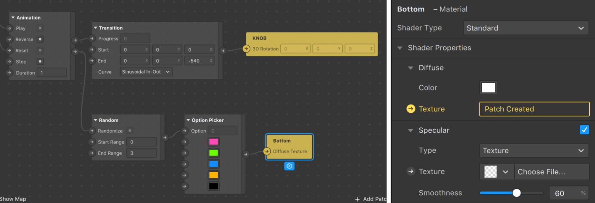

Afin que la couleur du haut soit différente de celle du bas de la capsule, nous allons implémenter une logique grâce aux patchs "IF Then Else", "Divide" et "Add". Changer le type du patch IF/Else à "Color" et effectuer les connections ci-dessous :

1. Option Picker output > If then Else / Then input
2. If then Else output > Divide First Value input (changer la seconde valeur en 1,5)
3. Divide output > Add First Value input (seconde valeur = 0,8)
4. Add output > input patch Texture créer pour le matériel du haut de la capsule

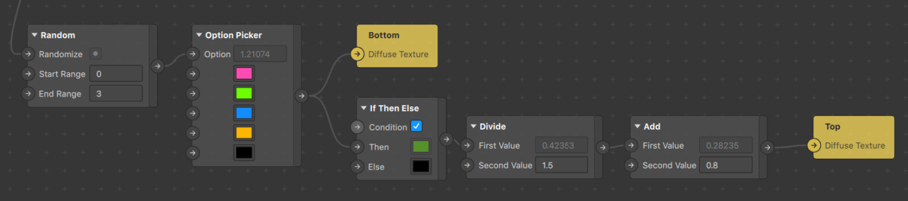

Dorénavant chaque fois que la couleur est randomisée, nous aurons cette même couleur appliquée à nos capsules, avec une variation pour le haut.

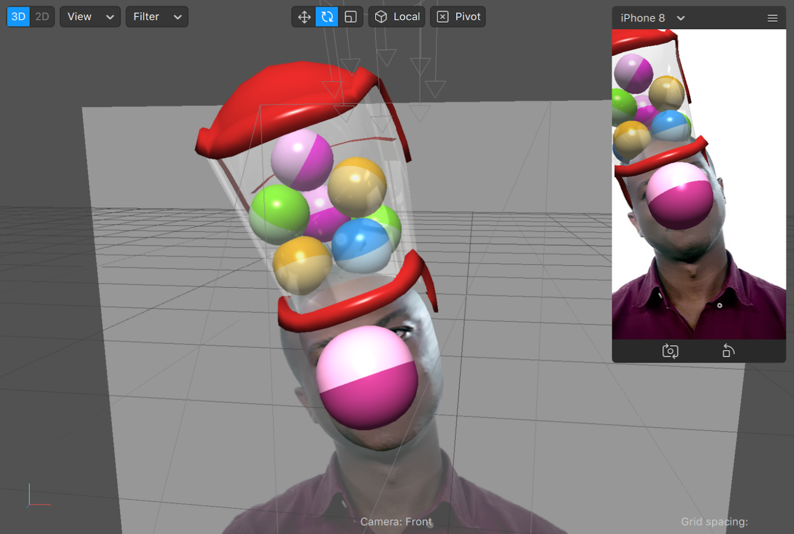

Nous allons maintenant rendre aléatoire quelle capsule apparaît lorsque l'utilisateur ouvre sa bouche.

Pour ceci nous allons importer 1 patch "Random", 5 patch "Round" et 5 "Equals Exactly"

1. A nouveau, connecter le patch d'Animation par sa sortie "Completed" à l'entrée "Randomize" du patch "Random" et changer l'"End Rang" à 4, puisque nous avons 5 jouets.
2. Random Value output >  chaque entrée des patchs "Round"
3. Round output > chaque entrée des patchs "Equals Exactly" avec, sur chaque seconde entrée de ces patch les valeurs 0, 1, 2, 3, et 4 respectivement.
4. Vous vous souvenez des 5 null objects que nous avons créer? Dans leur inspecteur sortez la "Visiblity" comme patch et connecter les 5 patchs résultants a un des patchs Equals Exactly.

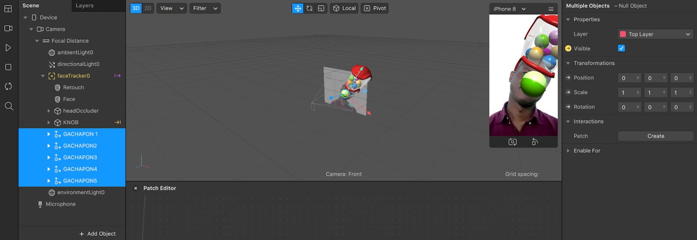
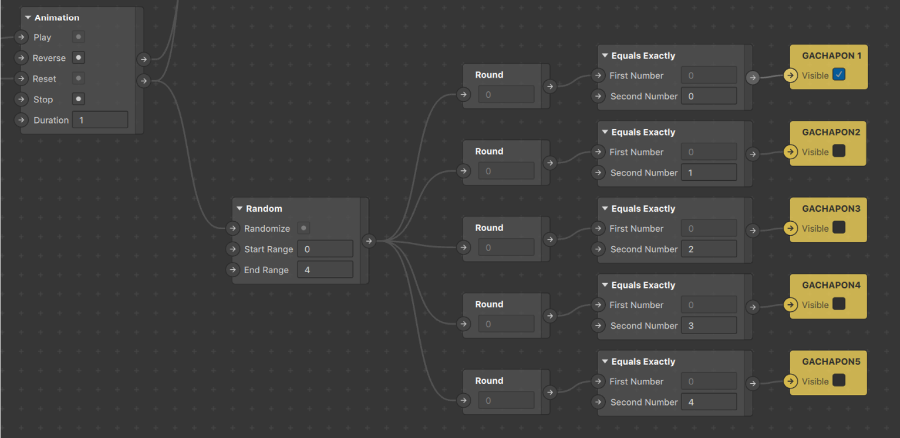

L'astuce ici étant que chaque fois que le Mouth Open est activé, les Gachapons 1 à 5 seront tous activés mais un seul sera visible. Pour des raisons de test, nous allons dé-connecter cette partie de la chaîne et ne laissez manuellement que Gachapon 1 visible. Ceci nous permettra de voir notre travail en temps réel avant de l'appliquer aux autres.

Hâtelons-nous à l'animation maintenant. Ce que nous voulons faire c'est animer les capsules, qu'elles sortent de l'intérieur de la bouche et s'ouvrent juste en-dehors. Il faudra dès lors que la capsule commence suffisament petite en taille que pour crédiblement sortir de la bouche. Nous allons donc animer sa taille.

Importons plusieurs patchs. Prenez un patch Animation et deux patchs Transitions, puisque nous cherchons a animer à la fois la position et la taille de la capsule. Fixer la Duration du patch d'animation a 0,5 afin de la rendre plus rapide. Souvenez-vous que ceci est bien notre second patch d'animation. En ce qui concerne le premier, nous allons récupérer son output "Completed" et le connecter à l'input "Play" de notre nouveau Animation patch. (il est plus simple de renommer le second patch Animation 2). Ce faisant, l'animation de la position de la capsule ainsi que celle de sa taille ne seront activées qu'une fois l'animation de la poignée terminée.

Si vous testez le projet actuellement, vous remarquerez qu'il marche une fois, mais ne disparaît pas après. Que faire si l'on veut relancer l'effet?

Porter maintenant votre attention sur le premier patch Pulse que nous avons ajouté, celui connecté au premier patch d'animation de la chaîne. Prenez son output "OFF" et connecter le à l'input "Reset" du patch Animation 2. Nous devrons faire ceci pour tous les patchs d'animation des capsules.

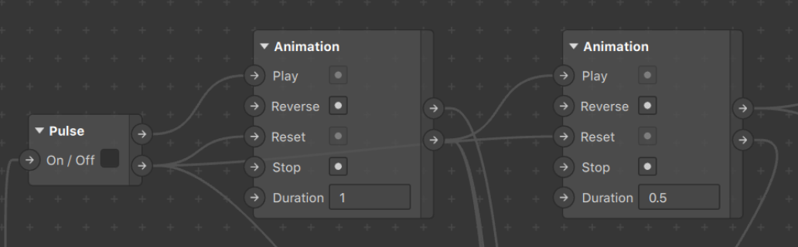

Retourner dans votre paneau de scène et sélectionnez votre objet null Gachapon 1 et aller dans l'inspecteur clicker sur la flèche à côté de "Position" et "Scale" afin de les importer comme patchs. Connecter un output de nos patchs Transition à l'input Position et l'autre à l'input Scale.

D'abord la position. Nous voulons que la capsule sorte de la bouche, soit animer sa profondeur, donc l'axe Z, que l'on va transitionner de -0,15 à 0,07. On peut constater que la capsule sort bien de la bouche maintenant mais sa hauteur n'est pas correcte. Pour ceci nous allons toucher à l'axe Y, en passant à la fois la valeur initiale et finale à -0,06. La capsule devrait être au niveau de la bouche maintenant.

Passons maintenant au patch Transition connecté à la taille. Nous allons passer la taille de 0,5 à 0,8 (n'hésitez pas à affiner en fonction de vos résultats)

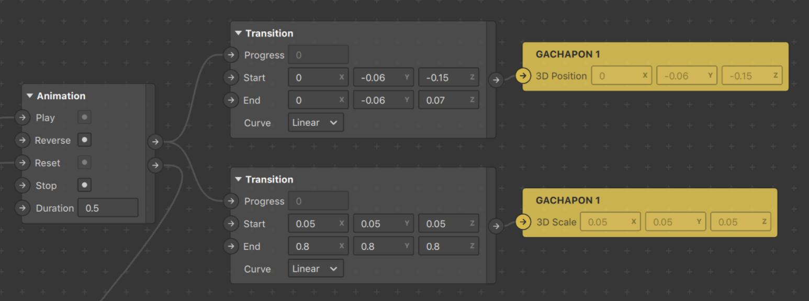

Maintenant que la première partie de l'animation est finie, passons à la suite. Ce que nous voudrions maintenant animer est l'ouverture de la capsule, soit les deux parties la composant, afin que l'objet à l'intérieur apparaisse. Pour ceci, ajoutons encore un patch Animation ainsi que 3 patchs Transition. Ceci est donc notre 3ème patch d'Animation. Le premier patch Transition sera pour le haut de la capsule, le second pour le bas de la capsule et le troisième pour la taille du jouet. Connecter l'output "Progress" de notre nouveau patch d'animation aux trois entrées "Progress" des patchs de Transition ajoutés.

Nous allons ensuite connecter l'output "Completed" du second patch d'animation à l'input Play du troisième patch animation (vous pouvez renommer ce dernier a Animation 3). De cette manière, notre nouvelle animation, l'ouverture de la capsule, jouera après l'animation de la capsule sortant de la bouche. Retournons donc sur notre premier patch Pulse et connectons le Off au Reset de notre Animation 3. N'oubliez pas de changer la valeur de sa Duration en 0,5.

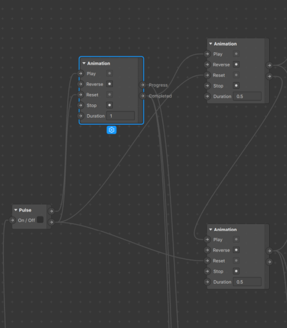

Enfin nous allons vouloir animer la partie supérieure de la capsule afin que celle-ci remonte ainsi que la partie inférieure de la capsule, qu'elle s'abaisse.
D'abord importons les patchs Position de ces deux objets et connectons l'output du patch Transition a la Position du haut de la capsule et l'autre patch Transition à la Position du bas de la capsule. Modifier seulement les valeurs finales des axes Y pour les deux. Pour le haut, 0,05 Y final et pour le bas -0,05 valeur finale.
Finalement il convient d'animer la taille des jouets une fois la capsule ouverte.
Pour ce faire, importer le patch Scale du premier jouet, ici le cube, dans l'inspecteur. Connectez-y l'output du 3ème patch de Transition. Modifiez les valeurs de fin de sorte que la valeur finale soit supérieure à celle initiale, par example 1 à 1,3.

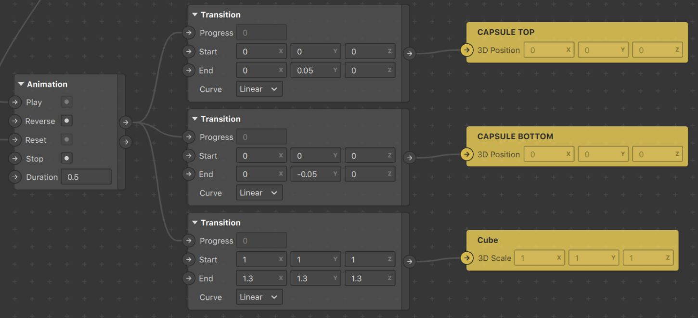

Bonus! Maintenant si nous voulions affiner un peu plus nous pourrions faire de même pour la rotation du jouet ou de la capsule. Il nous suffirait de refaire la même chose que plus haut en ajoutant un patch de Transition pour la nouvelle valeur à animer. Selon la durée de la rotation il conviendra peut-être d'ajouter un patch d'animation spécifiquement pour cette partie-ci, qui sera d'une Duration de 5 ou plus (pour une rotation lente)

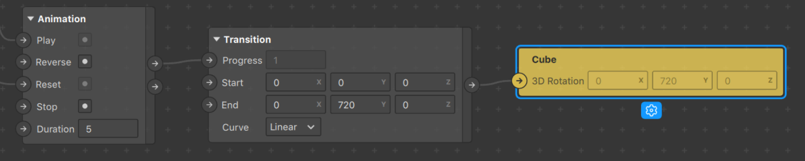

Nous avons maintenant une animation complète pour la première capsule gachapon. Quid des autres? Nous pouvons simplement dupliquer les animations 2, 3 et 4 ainsi que leurs transitions associées et répéter le même process pour les autres gachapons. Les patchs sélectionnés sont ceux qui vous devez dupliquer.

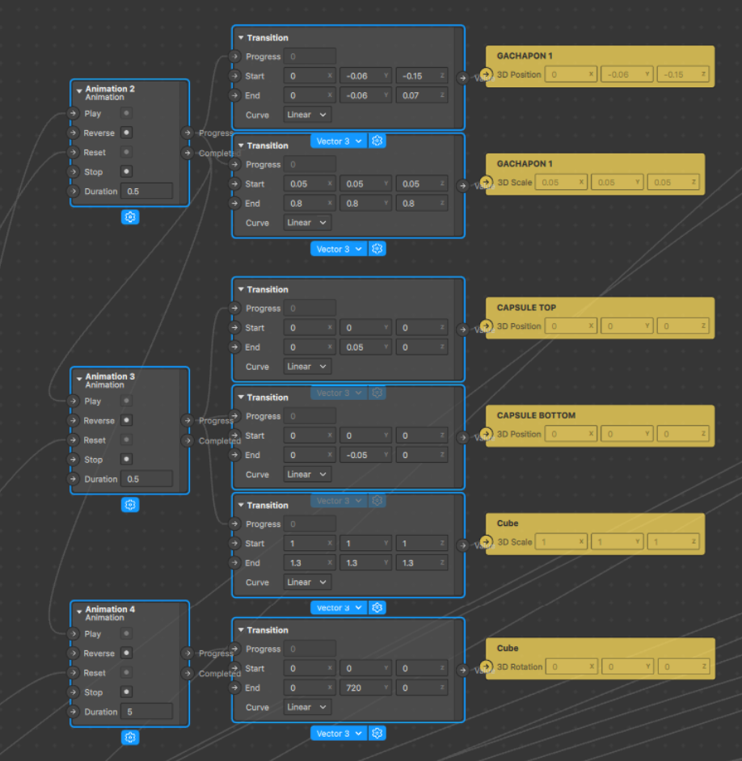

Dans ce projet, nous avons 5 gachapons, donc il conviendra de dupliquer ceci quatre fois. Votre projet devrait maintenant ressembler à ceci lorsque dézoomer. (lors de la duplication, ne déconnectez pas les patchs, nous aurons besoin de la plupart des connections existantes déjà).

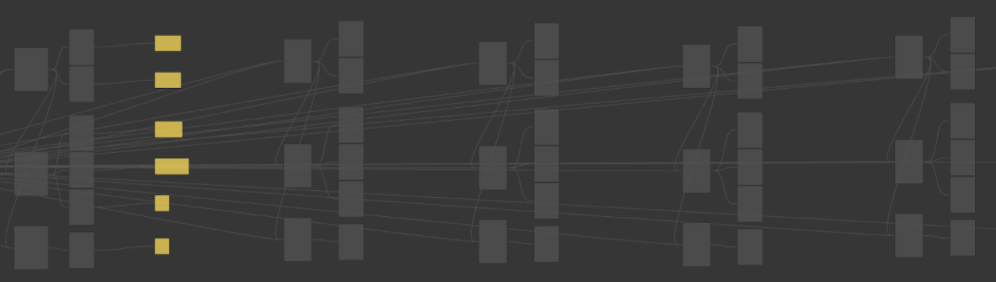

Il est enfin temps d'importer les patchs des paramètres des autres gachapon. Pour ce, sélectionnez Gachapon 1 et regardez dans l'inspecteur le nombre de paramètres importés (ils auront une boule jaune adjacente). Importés les mêmes pour Gachapon 2 à 5.

Vous devrez aussi importer la Position et Scale du null object contenant chaque gachapon, la Position de Capsule Bottom et Top ainsi que la Scale et Rotation du jouet contenu. Ceci se connectera comme suit :

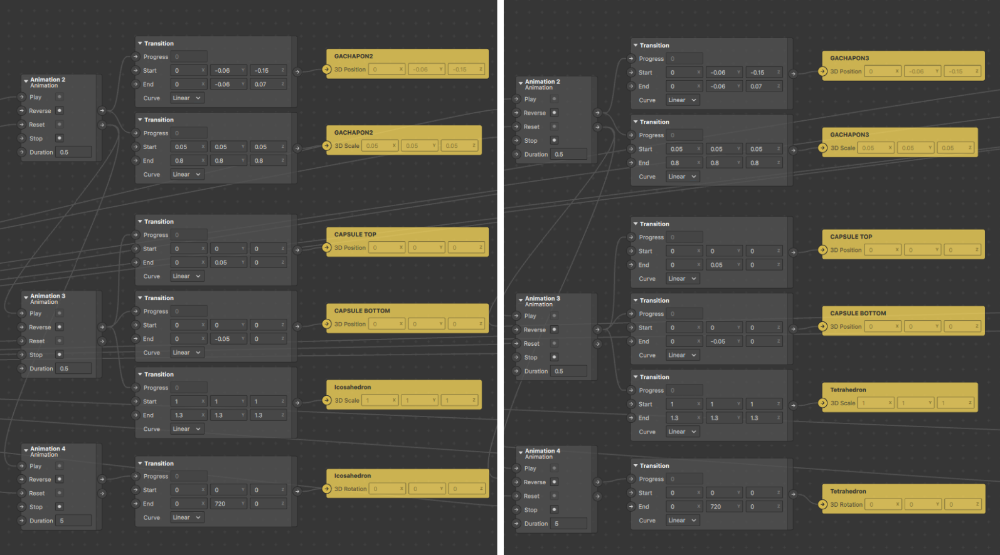
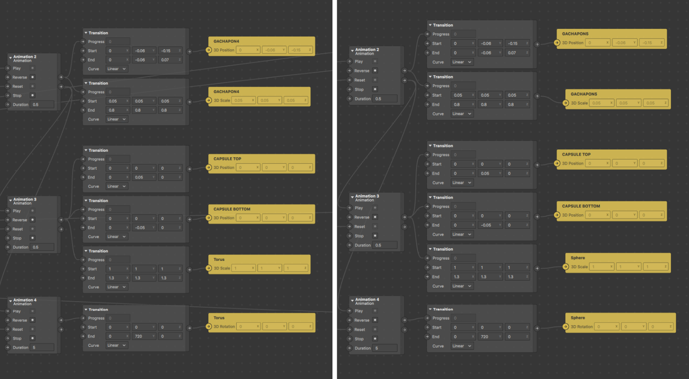

Une fois connectés, n'oubliez pas de retourner au patch Random afin de rétablir la partie aléatoire de la chaîne. Assurez-vous vous des connections et que le "End Range "soit bien fixé à 4 afin de cycler au travers des 5 possibilités.

Vérifier l'effet qui devrait maintenant marcher.

Bonus! Cette partie n'est pas obligatoire mais améliorera quelque peu l'effet. Vous remarquerez que l'utilisateur a tendance à fermer la bouche et non la garder ouverte le temps que l'animation entière se déclenche, ce qui fait disparaître la capsule et le jouet prématurément. Afin de le garder visible, nous allons utiliser un patch Delay entre le OFF du patch Pulse et toutes les entrées "Reset" des patchs d'animation. Vous pouvez par exemple retarder de 3 secondes la disparition de l'object après que l'utilisateur ait fermé sa bouche.

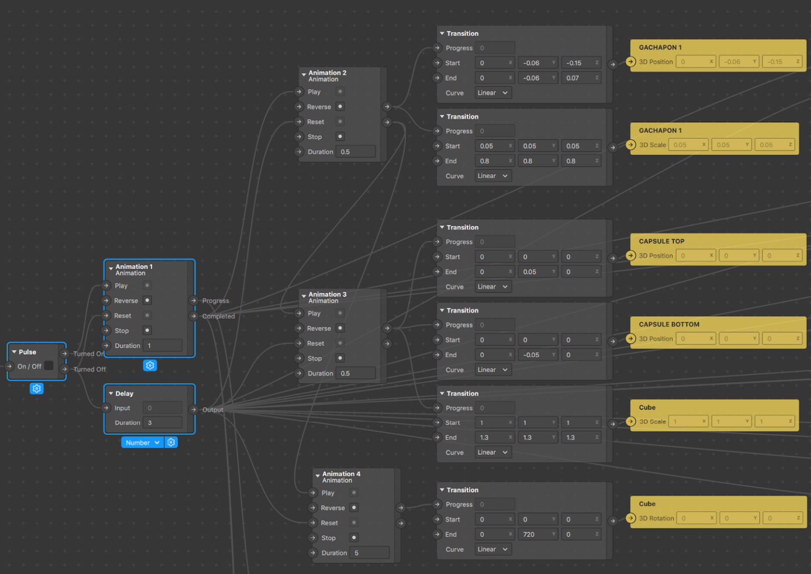

### 4ème partie - _Touches finales_

La dernière chose qu'il reste à faire est d'ajouter des instructions afin que l'utilisateur comprenne ce qui est attendu de lui.

Dans les options en haut de l'écran, aller dans "Project" puis "Edit Properties". Une nouvelle fenêtre va apparaître dans laquelle vous allez naviguer vers "Capabilities" et clicker sur le "+" en bas à droite. Chercher "Instructions" dans la barre de recherche et sélectionnez le. La nouvelle capacité devrait être listée. Clicker le rectangle à côté et checker "Custom Instructions". Dans le menu déroulant qui apparaît en cliquant sur le triangle à côté et le "+", choisisez "Open Your Mouth" et clicker "Insert". Vous pouvez fermer la fenêtre.

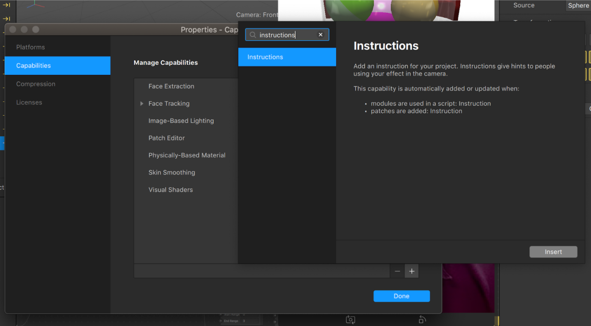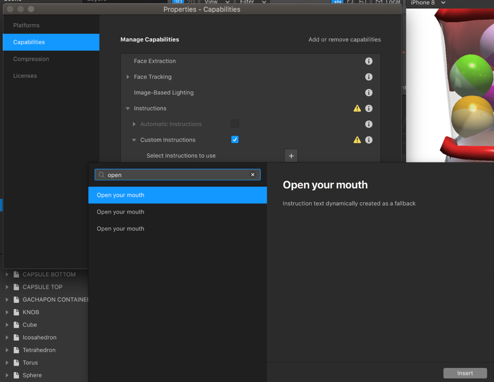

Il nous faudra maintenant deux trois patch pour ces instructions afin qu'elles apparaissent à l'écran. Pour ce faire, dans l'inspecteur de scène, sélectionnez "Device". Dans le paneau d'inspecteur à droite, clicker sur le dropdown nommer "Choose an Instruction" à côté de "On Opening".
Choisissez "See all instructions" si vous ne voyez pas "Open your Mouth". Une autre fenêtre apparaîtra dans laquelle vous pourrez chercher "Open your Mouth" le cas échéant. Sélectionner le. SparkAR devrait automatiquement créer une petite chaîne de patch pour cette instruction.

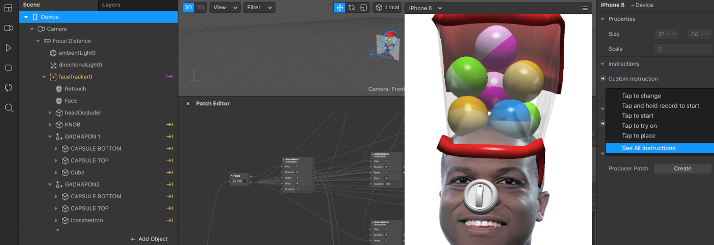

Le patch créer ressemble à ceci :

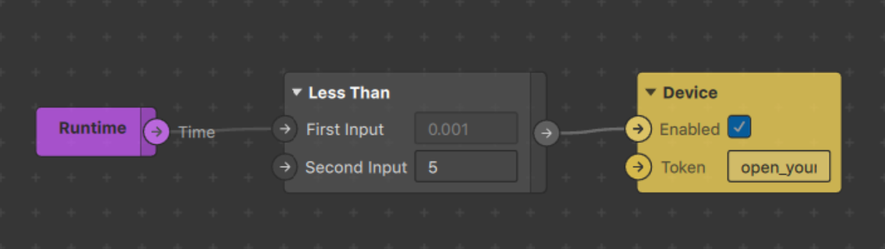

Dorénavant, lorsque votre effet sera ouvert, cette instruction apparaître le temps de 5 secondes. Afin de l'allonger, il suffit de changer la valeur dans le second input du patch "Less Than".